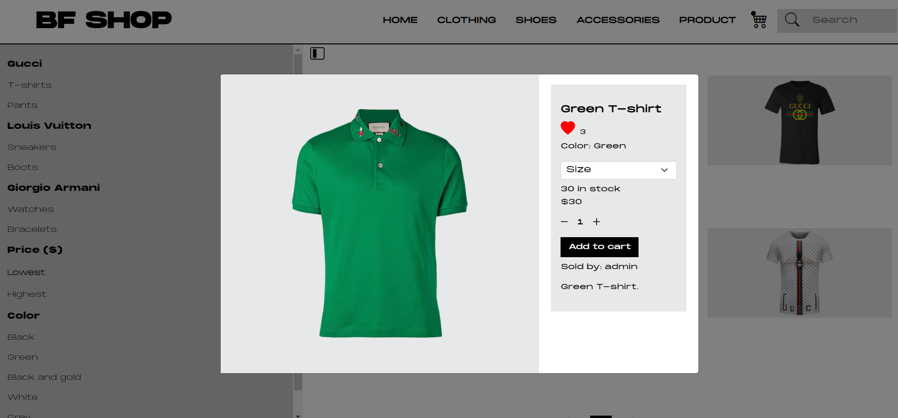

# BF SHOP - E-commerce Client Side

This project was made for the Company's (BF Marketing) portfolio.
The goal was to emulate a normal e-commerce site that sales men's luxury items (Clothing, Footwear, and Accessories) from brands such as Gucci, Louis Vuitton, Giorgio Armani.
It was built with MERN Stack (MongoDB, Express JS, React JS and Node JS) technology.

## Items used

- Clothing (T-shits and Pants)
- Footwear (Sneakers and Boots)
- Accessories (Watches and Bracelets)

### Server side 

This repository simply shows what happens on the client side. You can see the photos below or go directly to the site here: [https://flamboyant-darwin-dd503f.netlify.app](https://flamboyant-darwin-dd503f.netlify.app).
To see how the connection between the database, backend and frontend was made, you should go to the backend repository: [https://github.com/BF-Marketing/bfshop-server-side](https://github.com/BF-Marketing/bfshop-server-side)

### Homepage

### Products

### Product details

### Cart

